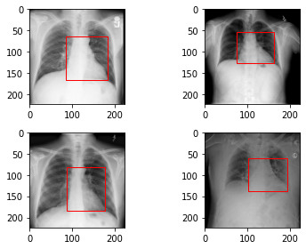
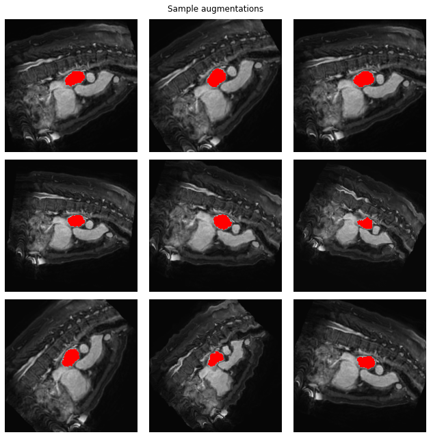

# Medical Images Analysis 

##  
The dataset used is: 

## [Heart Detection](https://github.com/mohamedelhacen/Medical_Images_Analysis/blob/master/Heart_Detection.ipynb) 
The dataset used is: 

## [Atrium Segmentation](https://github.com/mohamedelhacen/Medical_Images_Analysis/blob/master/Atrium%20Segmentation.ipynb)
The dataset used is: [Left Atrium from Medical Medical Segmentation Decathlon](http://medicaldecathlon.com/)

