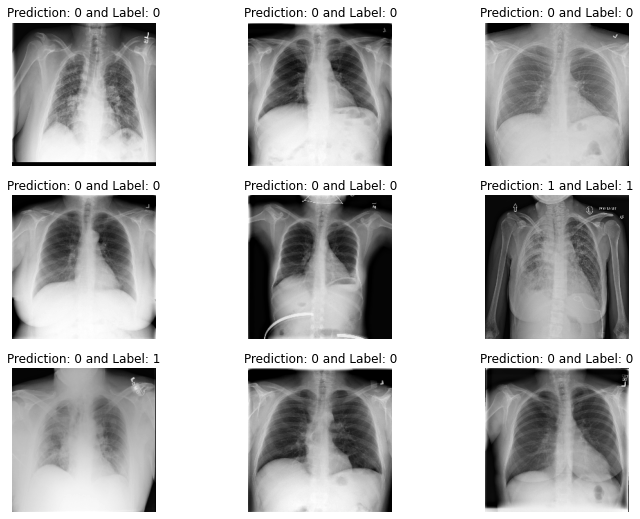
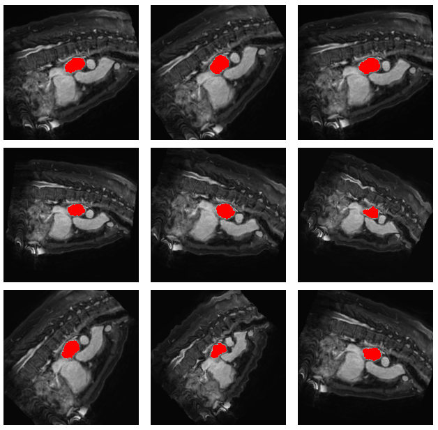

# Medical Images Analysis 

## Pneumonia Classification 
The dataset used is: 

## Heart Detection 
The dataset used is: 

## Atrium Segmentation
The dataset used is: [Left Atrium from Medical Medical Segmentation Decathlon](http://medicaldecathlon.com/)

